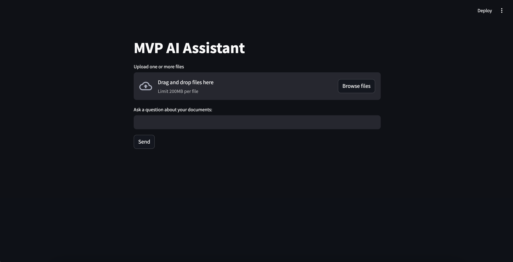
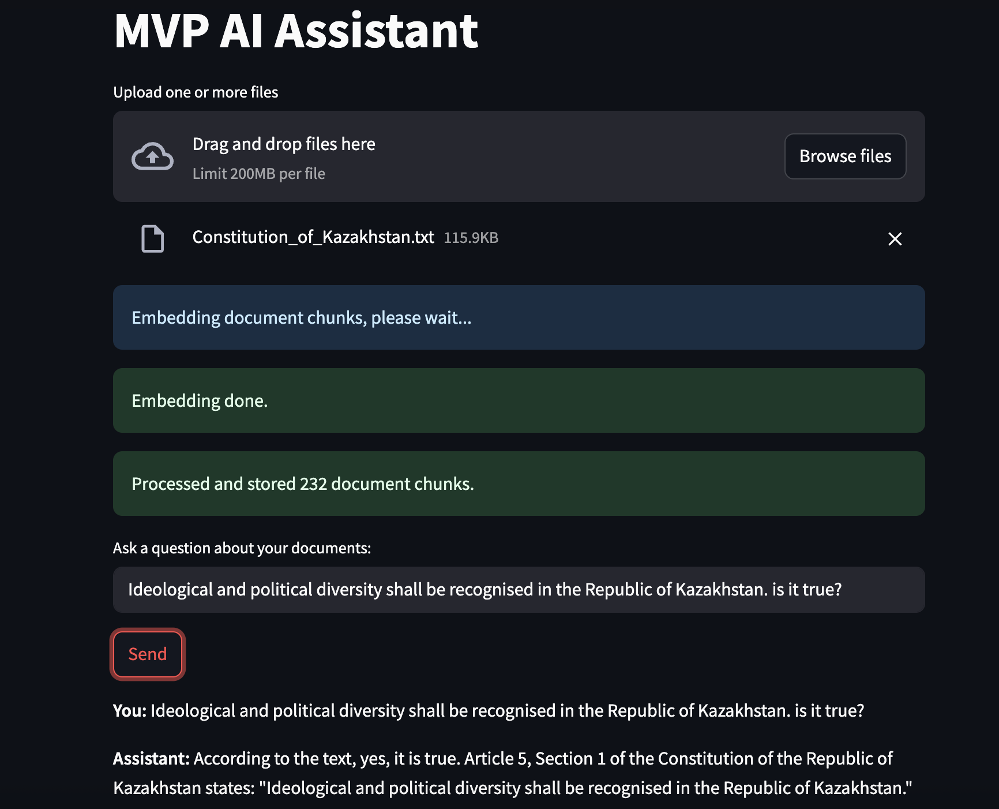

# 🚀 Document QA + Chat Deployment

This project demonstrates how to set up and run a Streamlit-based Document QA & Chat application using LangChain, Chroma, and OpenAI.

---

## 📦 Usage

### 1. Install dependencies

```bash
pip install -r requirements.txt
```

Your requirements.txt should include, at minimum:

```bash
streamlit
langchain-community
chromadb
openai
python-dotenv
```

## 2. Create .env
OPENAI_API_KEY=YOUR_FULL_API_KEY

## 3. Run the App
```bash
streamlit run app.py
```

Once the server starts, open your browser at the URL shown (usually http://localhost:8501).

## 4. Use the App

1. Upload one or more PDF, DOCX or TXT files via the uploader.

2. Wait for the app to display messages like:
- ✅ Loaded 10 pages from 1 file(s).
- ✅ Split into 30 chunks.

3. When indexing completes, the chat input box will appear. Type your question and press Enter.

4. The app will display an answer and list any source documents used.

## 🧾 Example Output
```bash
✅ Loaded 8 pages from 2 file(s).
✅ Split into 24 chunks.
🌱 Built vector store from your documents.

User: What does Section 3 cover?
Assistant: Section 3 outlines the rights and responsibilities of...
Sources:
- Constitution.pdf
```

🖼️ Demo Screenshot
### Main page


### Result


## 📁 Project Structure

```
📦Assignment3/
 ┣ 📂screenshots/
 ┣ 📂uploads/
 ┣ 📜README.md
 ┣ 📜app.py
 ┣ 📜requirements.txt
 ┗ 📜LICENSE
```